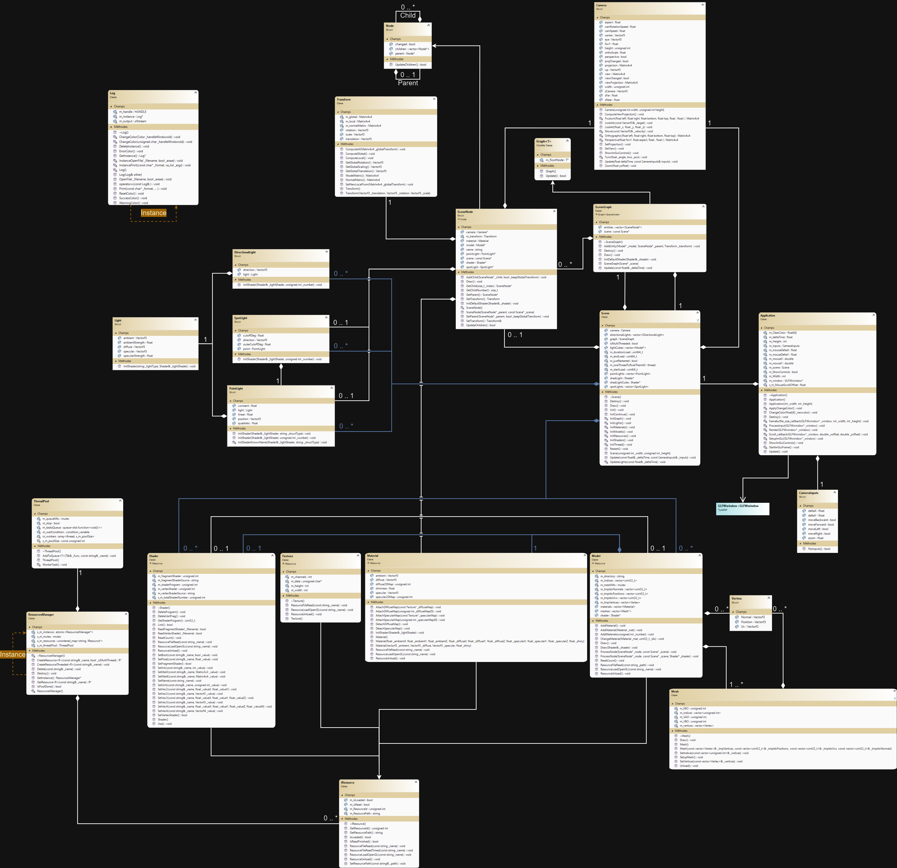
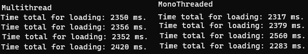
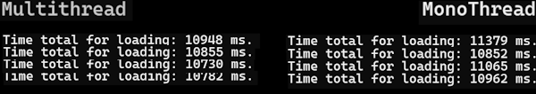
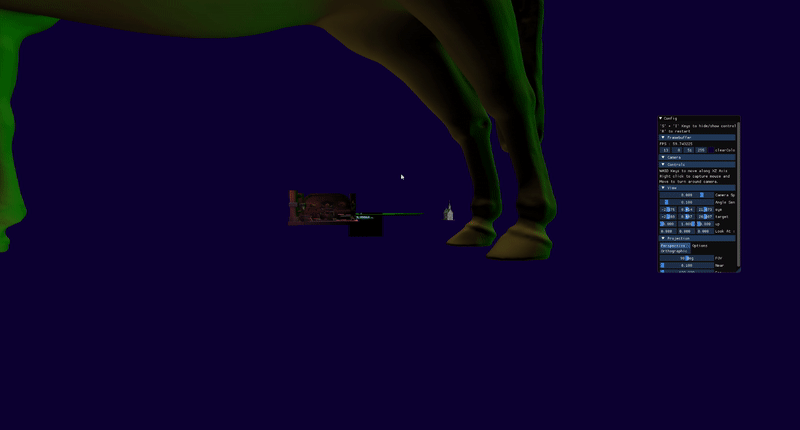
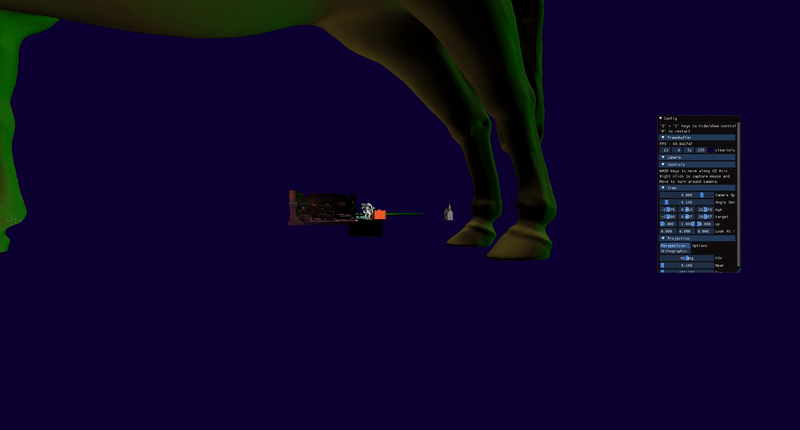

Resource Manager pegasus
==========================

Presentation
------------
Written in C++, using:

	OpenGL - v3.3.8 with glad - v0.1.34
	stb_image - v2.27
	dear imgui - v1.80

Reasonning
----------

1 thread per Resource.
Threadpool manages threads.
ResourceManager owns said Threadpool.

Functionning of Resource Loading in Multithread
---------------------------------------------------

1) Launch threads to read resources.
2) Create all the resources (empty).
3) Assign all threads to pool.
4) When a resource is read, free the pool slot for another. 
5) If a resource is not loaded:

		1. Check if the resource finished the reading.
		2. If this is the case, launch OpenGL resource setup.
6) Option for reload Scene multithread <=> monothread.\
		 *Reload is locked if any resource is not loaded*
7) On Scene destruction : Delete all resources and join all threads.

Architecture
------------
***********Le* Class Diagram**********

ResourceManager
---------------
Threadpool for file reading

20 (arbitrary) threads in the pool.

Main Thread
-----------
Indissociable from OpenGL thread.

Checks *periodically* the state of resource: when read, create openGL resource.

Speedtest comparaison
---------------------

Speedtest with 6 models\

Speedtest with 22 models\

### Monothread loading

### Multithread loading

